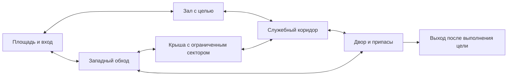

# Проверка текущих карт перед операциями

Исторический разбор до изменения карт. Реализованная часть описана в [BOTS_AND_MAPS.md](BOTS_AND_MAPS.md).

Дата: 6 сентября 2026 года. Проверены геометрия, правила появления, навигация, тесты и кадры существующей игры. Игровой код и планировка в рамках исследования не менялись. Внешние рекомендации с первоисточниками находятся в [MAP_DESIGN_RESEARCH.md](MAP_DESIGN_RESEARCH.md).

Главный вывод: сначала нужно определить роль каждой карты и исправить спавны, линии огня и поведение навигации. Добавлять операцию поверх текущей обороны рано. Предлагаю начать с Bastion, оставить Sandgate основой PvP и использовать Switchyard для обучения и испытаний. Это предложение, существующие режимы пока остаются доступны.

## Подтверждённые ограничения

### 1. На картах нет задач для отрядов

[MapDefinition](packages/game-core/src/maps/arena.ts) описывает блоки, спавны, припасы и названия районов. Для обороны есть только координаты защитников и врагов. Нет объектов защиты, зон захвата, маршрутов подкреплений или точек эвакуации. [Логика волн](packages/game-core/src/index.ts) выпускает противников и считает их уничтожение. A и B на Sandgate пока обозначают районы.

Следствие для операции: красивое здание само по себе не даёт ботам причин занимать этаж, удерживать двор или прикрывать штурм. Нужен отдельный слой целей и позиций для каждого режима. Геометрию можно переиспользовать.

### 2. Спавны не защищены от прямого огня

Проверка лучом на высоте глаз стоящего игрока нашла следующие пары точек FFA с прямой взаимной видимостью:

| Карта      | Видимые пары из 28 | Пример                                              |
| ---------- | -----------------: | --------------------------------------------------- |
| Switchyard |                 15 | Противоположные верхние площадки, около 38 м        |
| Bastion    |                  4 | Северная и южная площади через атриум, 30 м         |
| Sandgate   |                  7 | A и южный выход на длинную, 35 м; B и тоннель, 31 м |

Число пар не является оценкой баланса: в FFA контакт после появления допустим, но игроку нужно успеть понять угрозу и выйти в укрытие. Сейчас [выбор точки возрождения](packages/game-core/src/index.ts) максимизирует расстояние до ближайшего противника без проверки видимости. Щит на три секунды снижает последствия, но не исправляет геометрию выхода.

В Bastion два входа волн на северной и южной площадях видны из всех четырёх стартовых позиций защитников. [Выбор входа волны](packages/game-core/src/waves/director.ts) запрещает появление ближе 10 м и даёт невидимой точке бонус 15, но не запрещает видимые точки. Это допускает появление врага на глазах, хотя конкретный спавн зависит от позиций всех участников.

Предлагаю укрытые карманы появления, поворот перед выходом на линию боя и проверку видимости при выборе спавна. Для волн также нужны объявленные направления атаки и время подхода. Просто увеличить щит недостаточно.

### 3. Bastion открыт сразу с нескольких сторон

[Центральный зал](packages/game-core/src/maps/city.ts) имеет четыре входа, широкие оконные проёмы и отверстие в крыше. Боковые перегородки и укрытия уже есть, но центральная северо-южная ось простреливается насквозь. Визуальный осмотр кадров зала подтверждает сквозную видимость через противоположные двери. Это создаёт риск слишком большого числа одновременных угроз для одного защитника.

Две лестницы на крышу существуют, их подъём проверяют физические тесты. Но число лестниц не доказывает безопасность отступления: нужно отдельно проверять линию огня противника на каждом выходе и возможность пройти к следующему укрытию. Крыша и зал снабжаются патронами на месте, поэтому ресурсы слабо побуждают менять позицию. Это риск статичной обороны, а не измеренный процент времени кемпинга.

Предлагаю сделать внутри связку из двух боевых помещений с проходом под укрытием, сместить двери или поставить полноценную перегородку на сквозной оси. Для крыши определить полезный сектор обзора и путь ухода за сплошным укрытием. Не закрывать все окна и не уничтожать существующие обходы.

### 4. Sandgate даёт дальние линии, но слабо отделяет их от ближнего боя

[Крытый тоннель](packages/game-core/src/maps/sandgate.ts) имеет кровлю 16 × 16 м и почти прямой проход к B. Луч от точки появления в тоннеле до точки на B проходит 31 м без препятствия. Крыша над проходом сама по себе не делает его территорией дробовика.

С точки восточной террасы `{x: 30.8, y: 1.23, z: -17}` видны четыре из пяти входов волн, с западной три. Это проверка видимости конкретных координат, без оценки вероятности убийства, угла поворота или защищённости самого снайпера. Тем не менее такое расположение заслуживает проверки до добавления новых волн.

Предлагаю сохранить длинную для снайперки, в тоннелях сделать излом и защищённое сближение, ограничить обзор террасы её боевым сектором. У короткого пути должна быть цена: меньше обзор или опасный выход. Для обороны следует отдельно переставить входы подкреплений.

На заднем переходе есть ещё одна проблема читаемости движения. Ящик патронов у `{x: 16, z: -23}` имеет физическую высоту 0,4 м, а автоматический шаг контроллера ограничен 0,28 м. В браузерном прогоне движение влево остановилось у него на `{x: 16.785, z: -23.220}`. Пройти можно севернее или перепрыгнуть, но низкий предмет прерывает ожидаемый прямой маршрут. При переделке карты припасы лучше сместить к стене, сохранив свободную полосу движения.

### 5. Зацикливание ботов нельзя решить только перестановкой стен

В [навигации и поведении бота](packages/game-core/src/bots/brain.ts):

- Патруль циклически перебирает точки старта защитников, затем спавны FFA. Это повторяемый маршрут, не задача отряда.
- Граф использует сетку с шагом 2 м и четыре соседних направления. Он не описывает стоимость опасного прострела, укрытие, предпочтительный сектор оружия или занятые союзниками позиции.
- Поиск привязывает цель к ближайшему узлу без проверки доступности точного отрезка от узла до цели.
- При пустом пути бот идёт непосредственно к цели. Повторное планирование каждые 0,8–1 с не учитывает длительность отсутствия прогресса и не исключает уже неудачную цель.
- Поиск припасов выбирает ближайший ящик по прямому расстоянию, без стоимости реального маршрута.

Это подтверждённые условия для бесполезных повторов, но конкретный эпизод пользователя с циклением на базе не воспроизведён. Нужны запись продвижения к цели, смена неудачного маршрута и проверка достижимости конечного участка. Пустой путь также может означать совпадение ближайших узлов, поэтому считать любой такой результат недостижимой зоной нельзя.

### 6. Дальнейшее увеличение пока не обосновано

Bastion и Sandgate уже имеют размер 64 × 56 м. Базовая скорость 8,5 м/с, максимальная 18 м/с. При этих скоростях расстояния из CS нельзя переносить без проверки.

| Маршрут                                           | Длина по текущему графу | Длина / 8,5 м/с |
| ------------------------------------------------- | ----------------------: | --------------: |
| Sandgate, от спавна B к спавну A                  |                  48,3 м |           5,7 с |
| Sandgate, крайний задний обход с запада на восток |                  62,2 м |           7,3 с |
| Bastion, восточная задняя улица с юга на север    |                  44,8 м |           5,3 с |

Это расчёт по ломаной сеточного пути, включая отрезки к точным концам. Это не секундомер игрока: не учитываются разгон, повороты, класс, прыжки и бой; сглаженный человеческий маршрут может быть короче. Не доказано ни то, что карты тесны, ни то, что они слишком велики. Сначала следует измерить время до контакта в соло и при восьми участниках, использование боковых улиц и время безопасного отхода.

Switchyard сохраняет пользу как полигон и трасса движения. Её низкий проход требует приседания, а граф ботов проверяет капсулу высотой 1,8 м. Поэтому наличие человеческого маршрута под переходом не означает, что бот использует тот же маршрут.

### 7. Архитектура пока слабо объясняет маршрут

На осмотренных кадрах Bastion видны повторяющиеся окна и близкие по цвету фасады вокруг зала и крыши. Периферийные дома в геометрии являются закрытыми объёмами. Получается узнаваемая площадь, но не последовательность разных помещений для штурма. Вывески и миникарта помогают ориентироваться, однако полезные выходы и недоступные декоративные фасады стоит различать и без чтения текста.

Предлагаю придать районам разные крупные признаки: навес кафе, въезд служебного двора, вход в архив, ограждённый технический выход с крыши. Внутри здания нужны различимые помещения и дверные связи. Мелкие детали добавлять после проверки боя, сохраняя простые фоны на уровне силуэта противника. Это качественная оценка просмотренных кадров, не исследование распознавания врагов игроками.

## Схема для обсуждения Bastion

Это схема предполагаемых связей, не точный чертёж текущей геометрии. Перед строительством для каждого ребра нужно выбрать укрытия и проверить прострелы. Защищённость указанных путей пока является требованием.



Игрок должен иметь возможность оставить занятую позицию, скрыться от текущего стрелка и выйти на другой подход. Это не гарантия спасения от окружения командой: обе стороны сохраняют возможность перекрывать маршруты.

## Порядок следующей работы

1. Разметить Bastion по боевым зонам, целям, секторам наблюдения и входам подкреплений. Для каждой сильной позиции указать пользу, уязвимость и отход.
2. Исправить сквозную ось зала, спавны и один защищённый обход. На простой геометрии проверить близкий бой, среднюю дистанцию и сектор снайпера.
3. Добавить контроль продвижения ботов и задачи отрядов. Прогнать каждый вход к каждой цели, в том числе при заблокированном основном проходе.
4. Только затем собрать короткую операцию. Проверить её в соло, с союзными ботами и с людьми.
5. Отдельно доработать Sandgate под PvP. После замеров решать, требуется ли другая площадь карты.

Существующие тесты проверяют отдельные проходы, подъём по лестницам, наличие пути в графе и факт стрельбы ботов. Они не доказывают баланс классов, покрытие всех маршрутов или честность спавнов. Для следующего пакета нужны записи маршрутов ботов, повторяющихся неудачных целей, мест смертей и дистанций попаданий. Замеры производительности повторять по [PERFORMANCE.md](PERFORMANCE.md) при том же числе участников.

При проверке перед публикацией `pnpm check` прошёл, включая 136 тестов. Первый браузерный прогон дал 18 успешных сценариев и два сбоя перемещения; оба прошли при отдельном повторе. Записи показали, что тест Bastion пробежал мимо лестницы до x=13,56 при правом крае ступеней x=12,9, а тест Sandgate попал в ящик на заднем проходе. В тестах добавлены остановка перед сменой направления и медленное выравнивание. Маршрут Sandgate проходит севернее ящика. Это изменения управления в проверках, не исправление геометрии. Финальный полный прогон Firefox после этих изменений завершился успешно: 20 из 20 сценариев. Проверка Chromium headless с захватом мыши по прежней договорённости остаётся отложенной.

## Повторить геометрические измерения

```sh
pnpm build:packages
node scripts/inspect-maps.mjs
```

Скрипт использует существующие карты и физические проверки лучом, не меняет игру и печатает JSON. Индексы спавнов и входов волн начинаются с нуля. Луч проходит между точками на высоте 1,65 м над координатой ног. Это выборка, а не полный анализ видимости всех позиций и поз тела. Результаты нужно перепроверять после изменения геометрии.
