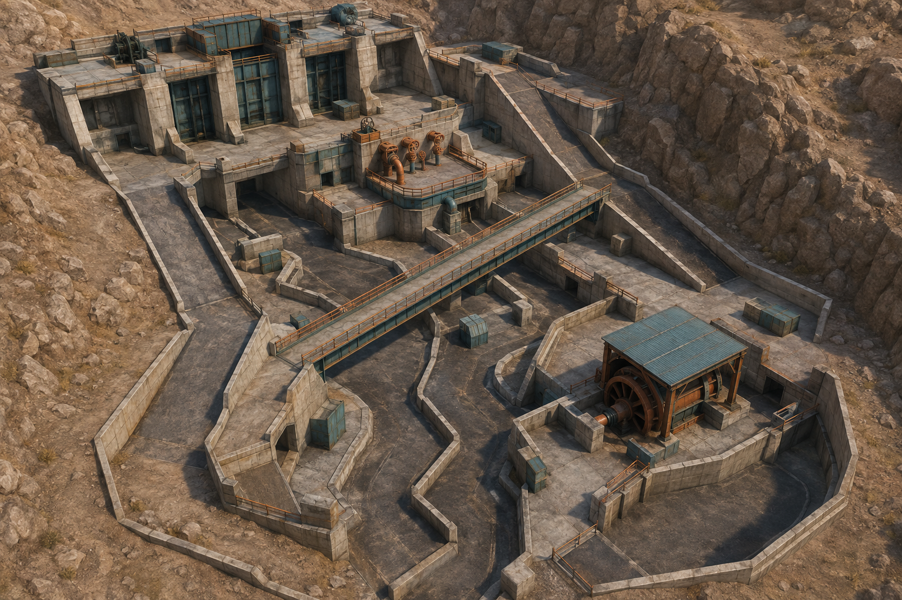
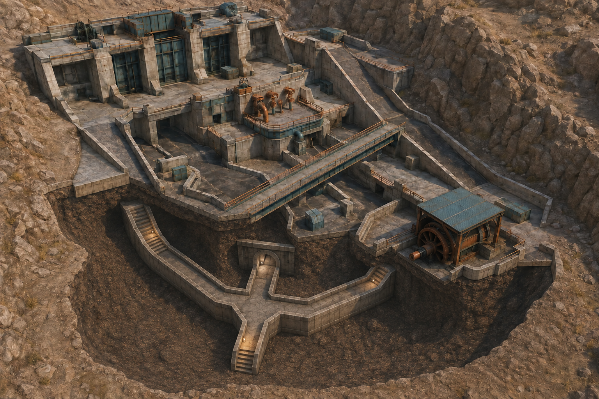

# Spillway: сухой водосброс



**Статус:** карта реализована в `packages/game-core/src/maps/spillway.ts` и доступна в меню игры для арены, ботов и обороны.

Последующие изменения геометрии, исправления и проверки: [пересборка Spillway](SPILLWAY_REBUILD.md). Ниже сохранён исходный концепт; его размеры и детали не являются точной спецификацией текущей реализации.

## Идея

Spillway стоит на склоне. Северо-западный край карты выше юго-восточного на 6 метров. Через карту проходит сухой бетонный канал. Над ним лежит косой технический мост.

Это не кольцо, не двор с комнатами по сторонам и не стандартные три коридора. Здесь две основные трассы пересекаются, но не соединяются в точке пересечения. Игрок на мосту проходит над игроком в канале. Сменить уровень можно по двум широким скатам дальше от центра.

Получается хороший выбор. Быстрый путь идёт по мосту и оставляет игрока на виду. Канал безопаснее от дальнего огня, но в нём много близких углов. Боковой водосброс даёт среднюю дистанцию и приводит к нижней части карты.

## Почему эта карта не похожа на текущие

| Карта      | Основная форма                                        |
| ---------- | ----------------------------------------------------- |
| Switchyard | Симметричная промышленная арена с площадками по краям |
| Bastion    | Центральное здание и городские улицы вокруг него      |
| Sandgate   | Длинная улица, центр и тоннели                        |
| Spillway   | Диагональный склон, канал внизу и мост над ним        |

У Spillway нет центральной комнаты. Нет внешнего маршрута вдоль границы. Центр карты физически разделён по высоте.

## Общий план

Уровни:

- `+5` означает верхнюю площадку.
- `+3` означает мост и клапанную площадку.
- `0` означает дно канала и нижний бассейн.
- `↘` означает широкий спуск.

```text
                                 СЕВЕР

       ┌─────────────────────────────────────────────────────┐
       │                                                     │
       │  ВЕРХНИЙ ЗАТВОР +5                                  │
       │  появление 1  R1 / S1                               │
       │      ┌───────────────────┐                          │
       │      │                   └══════╗                   │
       │      └───────┐                  ║                   │
       │              │  КЛАПАННАЯ +3   ║ МОСТ +3           │
       │   западный ↘ │     A1 / M1      ║ S2 / A2           │
       │      спуск   └───────────────╲══╝                   │
       │          ╲                    ╲                      │
       │           ╲                    ╲ восточный спуск     │
       │            ╲                                          │
       │  СУХОЙ КАНАЛ 0 ───── ПОД МОСТОМ ──────┐             │
       │  V1 / H1              V2 / H2          │             │
       │          ╲                              │             │
       │           ╲                             │             │
       │            └──── ТУРБИНА 0 ───────┐    │             │
       │                  M2 / H3           │    │             │
       │                                    │    │             │
       │                         БОКОВОЙ ВОДОСБРОС +1          │
       │                              R2 / A3     ╲            │
       │                                            ╲          │
       │                          НИЖНИЙ БАССЕЙН 0  появление 2│
       │                               M3 / R3                 │
       │                                                     │
       └─────────────────────────────────────────────────────┘

                                  ЮГ
```

Схема показывает направление склона, а не точный масштаб. В блок-ауте карта занимает примерно 60 на 44 метра.

## Как игрок движется по карте

С верхнего затвора доступны два решения. Игрок может выйти на клапанную площадку и мост либо спуститься в канал. Оба пути ведут вниз, но сходятся только возле турбины.

Из нижнего бассейна тоже есть выбор. Можно подняться по боковому водосбросу, пройти через турбину или использовать восточный спуск к мосту.

Мост пересекает канал без лестницы в центре. Благодаря этому встреча не сваливается в одну дверную перестрелку. Игроки слышат друг друга и видят отдельные участки, но продолжают движение на своём уровне.

## Главные зоны

### Верхний затвор

Открытая площадка с двумя бетонными затворами. Между ними стоит машинный шкаф высотой около 2,4 метра. Он разрывает дальний прострел и закрывает точки появления.

Ширина зоны около 18 метров. Длинная линия идёт вдоль края площадки, а не через всю карту.

### Клапанная площадка

Средний уровень с крупными трубами и тремя бетонными опорами. Здесь штурмовик быстро меняет направление, а пулемётчик может удерживать вход на мост.

Опоры полностью закрывают игрока. Тонкие перила остаются декором и не считаются надёжным укрытием.

### Технический мост

Косой мост шириной 6 метров и длиной около 24 метров. В середине стоит глухой короб вентиляции. Он делит линию огня на две части.

Под мостом нет лестницы. Спуск с моста находится на его восточном конце. Так мост остаётся осознанным маршрутом, а не универсальной силовой позицией.

### Сухой канал

Канал имеет ширину от 7 до 10 метров. Его стены слегка ломаются по направлению, поэтому с одного конца нельзя видеть другой. Две дренажные трубы создают короткие укрытия, но в них нельзя зайти.

Западный спуск входит в канал под углом. Игрок видит место приземления заранее и не падает прямо под дробовик.

### Турбина

Это не помещение. Огромный разобранный ротор лежит под навесом и делит нижний маршрут. Обойти его можно с обеих сторон.

Навес защищает от моста, но не от игроков в канале или нижнем бассейне. У зоны четыре направления атаки, поэтому долго сидеть здесь опасно.

### Боковой водосброс

Широкая наклонная плита с бетонными рёбрами. Она связывает мост, турбину и нижний бассейн. Рёбра создают ритм коротких выходов для револьвера и автомата.

Это самый заметный путь снизу вверх. Он быстрее прохода через турбину, но игрок виден с нижней площадки.

### Нижний бассейн

Неглубокая открытая чаша с двумя насосными блоками. Насосы закрывают точки появления и не дают прострелить бассейн насквозь.

Здесь нет тупика. Один выход ведёт к турбине, второй к боковому водосбросу, третий к восточному спуску.

## Подземный технический коллектор



Нижняя открытая грань на разрезе нужна только для показа развилки. В игровой геометрии там будет глухая стена, а не четвёртый выход.

На первом рендере полноценного подземного хода не было. Тёмные проёмы обозначали пространство под мостом и ниши в подпорных стенах. В обновлённой версии появился короткий коллектор на глубине около 2,5 метра.

```text
                           ПОВЕРХНОСТЬ

       сухой канал       турбина          боковой водосброс
            │               │                     │
           U1              U2                    U3
            ╲               │                    ╱
             ╲───────┐      │      ┌────────────╱
                     └── Т-образный ──┘
                         коллектор
                              │
                    резервная точка появления
```

Три выхода дают неожиданные появления в разных частях карты:

- `U1` выходит в сухой канал под мостом.
- `U2` выходит за широкой стороной турбины.
- `U3` выходит между бетонными рёбрами бокового водосброса.

Сам тоннель короткий. От центрального разветвления до любого выхода игрок идёт от 4 до 6 секунд. Между выходами нет прямой видимости. Каждый участок делает один поворот под прямым углом.

Ширина прохода составляет 4,5 метра, высота потолка 3 метра. Этого хватает для встречного движения и боя, но недостаточно для длинного прострела. Лестницы не нужны. Все переходы делаются ступенями или пологими скатами, которые уже поддерживает движение игры.

В обычном матче внутри коллектора находится одна дополнительная точка появления. Две глухие стенки закрывают её от всех трёх выходов. После появления игрок сразу выбирает U1, U2 или U3.

Я бы не ставил отдельную точку появления у каждого выхода. Подземные точки почти всегда скрыты от противника, поэтому текущая функция `chooseRespawn` будет предпочитать их чаще открытых точек. Одной подземной точки достаточно для сюрприза. Матч не превратится в постоянное вылезание из люков.

Перед выпуском стоит поднять минимальную дистанцию до противника для этой точки с текущих 2 метров хотя бы до 8 метров либо добавить задержку перед повторным использованием. Без этого противник сможет караулить развилку.

В коллекторе не должно быть припасов и точек `guard` или `overwatch`. Он нужен для движения. Если дать игрокам повод задерживаться внутри, неожиданный выход быстро станет обычным кемпингом у развилки.

## Размеры первого блокаута

| Участок                      | Размер или дистанция |
| ---------------------------- | -------------------: |
| Вся карта                    |     около 60 на 44 м |
| Перепад высоты               |            около 5 м |
| Технический мост             |            24 на 6 м |
| Сухой канал                  |  ширина от 7 до 10 м |
| Нижний бассейн               |     около 20 на 16 м |
| Клапанная площадка           |     около 18 на 15 м |
| Западный спуск               |         ширина 5,5 м |
| Восточный спуск              |         ширина 6,5 м |
| Самая длинная полезная линия |        от 32 до 38 м |

Спуски должны быть пологими. Игрок не теряет управление и не цепляется за стыки коллайдеров.

## Позиции снайпера

Рабочая дистанция снайпера в текущей логике равна примерно 30 метрам.

| Точка | Где                               | Что видно                                    | Почему позиция не доминирует                         |
| ----- | --------------------------------- | -------------------------------------------- | ---------------------------------------------------- |
| S1    | Край верхнего затвора             | Клапанную площадку и начало западного спуска | Машинный шкаф закрывает мост и нижнюю карту          |
| S2    | Западная половина моста           | Боковой водосброс на дистанции около 35 м    | Вентиляционный короб закрывает вторую половину моста |
| S3    | Верхняя ступень восточного спуска | Нижний бассейн                               | Игрок открыт со стороны клапанной площадки           |

На схеме отмечены S1 и S2. S3 находится там, где восточный спуск отходит от моста.

Снайпер всегда выбирает один сектор. Ни одна позиция не видит одновременно верхний затвор, канал и бассейн.

## Позиции пулемётчика

Пулемётчику нужна дистанция около 24 метров и твёрдое укрытие для перезарядки длиной 6 секунд.

| Точка | Где                             | Что держит             | Путь обхода                                 |
| ----- | ------------------------------- | ---------------------- | ------------------------------------------- |
| M1    | За трубой клапанной площадки    | Вход на мост           | Западный спуск и канал                      |
| M2    | За корпусом турбины             | Выход из сухого канала | Боковой водосброс и обратная сторона ротора |
| M3    | Между насосами нижнего бассейна | Восточный спуск        | Турбина и боковой водосброс                 |

Каждая позиция закрывает один подход. Стоящий на месте пулемётчик всегда оставляет открытым бок или высоту.

## Позиции штурмовика

| Точка | Где                               | Работа позиции                            |
| ----- | --------------------------------- | ----------------------------------------- |
| A1    | Центр клапанной площадки          | Поддерживать мост и западный спуск        |
| A2    | Восточный конец моста             | Переходить между верхним и нижним уровнем |
| A3    | Средняя часть бокового водосброса | Помогать турбине и нижнему бассейну       |

Штурмовик лучше остальных связывает уровни. Его сильные позиции находятся на переходах, а не в концах карты.

## Маршрут разведчика

| Точка | Где                      | Следующий ход                                 |
| ----- | ------------------------ | --------------------------------------------- |
| V1    | Излом сухого канала      | Под мост или на западный спуск                |
| V2    | Тень под мостом          | К турбине либо назад по другой стороне канала |
| V3    | Обратная сторона турбины | В нижний бассейн или на водосброс             |

Это быстрый ломаный маршрут. На нём нет линии длиннее 14 метров. Разведчик может пройти снизу под снайпером на мосту, но на выходе его слышно и видно с турбины.

## Позиции тяжёлого бойца

| Точка | Где                          | Ближний сектор   | Контратака                          |
| ----- | ---------------------------- | ---------------- | ----------------------------------- |
| H1    | Поворот сухого канала        | Западный спуск   | Огонь сверху с клапанной площадки   |
| H2    | Под мостом у дренажной трубы | Проход к турбине | Отход назад по широкой части канала |
| H3    | Узкая сторона ротора         | Обход турбины    | Широкая сторона ротора и водосброс  |

У дробовика нет своей закрытой комнаты. Он силён на трёх поворотах, а между ними вынужден пересекать открытые участки.

## Позиции стрелка

| Точка | Где                            | Дистанция и укрытие                             |
| ----- | ------------------------------ | ----------------------------------------------- |
| R1    | Машинный шкаф верхнего затвора | Выход на 18 или 22 метра из-за твёрдого угла    |
| R2    | Бетонные рёбра водосброса      | Серия коротких выходов на 15 или 20 метров      |
| R3    | Насосный блок нижнего бассейна | Выход на восточный спуск длиной около 24 метров |

Револьвер не получает бесконечную линию. После промаха противник успевает сменить ребро или приблизиться.

## Точки появления

Для обычного матча нужно девять точек появления. Они стоят за крупными объектами и не совпадают с сильными позициями.

1. За западным затвором.
2. За машинным шкафом верхней площадки.
3. В начале западного спуска за бетонной стеной.
4. В дальней части сухого канала за изгибом.
5. Под восточной опорой моста.
6. За широкой стороной ротора.
7. За первым насосом нижнего бассейна.
8. За верхним ребром бокового водосброса.
9. На Т-образной развилке подземного коллектора за двумя глухими стенками.

С любой точки игрок получает два направления движения не позднее чем через 2 секунды. Подземная точка даёт три направления. Прямых линий между точками появления нет.

## Режим обороны

Spillway хорошо подходит для обороны без отдельной переделки карты.

Защитники начинают возле турбины. Противники входят через верхний затвор, дальний конец сухого канала и нижний бассейн. Отдельные волны могут входить через U1 или U3. Эти входы скрыты перепадом высоты и бетонными стенами.

Турбину нельзя защищать одной линией. Верхний мост, канал, водосброс и коллектор требуют смотреть в разные стороны. Медленный пулемётчик полезен, но не может закрыть все входы.

## Навигационные роли ботов

| Точки                            | Роль        |
| -------------------------------- | ----------- |
| S1, S2, S3                       | `overwatch` |
| M1, M2, M3                       | `guard`     |
| V1, V2, V3                       | `flank`     |
| U1, U2, U3 и развилка коллектора | `flank`     |
| H1, H2, H3                       | `flank`     |
| A1, A2, A3                       | `advance`   |
| R1, R2, R3                       | `advance`   |

Карта требует навигации минимум на двух высотах. Для каждого спуска нужны промежуточные точки маршрута. Бот не должен пытаться срезать путь прыжком с моста.

## Производительность

Тема водосброса хорошо подходит слабым компьютерам. Основная архитектура состоит из коробок, наклонных плит и нескольких цилиндрических деталей.

- Вода отсутствует. На дне остаются только цвет, потёки и простые декали.
- Высокие подпорные стены скрывают дальнюю часть карты.
- Из канала не видны верхний затвор и нижний бассейн одновременно.
- Вентиляционный короб делит мост на два сектора.
- Корпус турбины можно собрать из простого цилиндра для картинки и прямоугольного коллайдера для физики.
- Повторяющиеся бетонные рёбра используют одну геометрию через инстансинг.
- Трубы получают низкое число сегментов. Дальние трубы заменяются коробами.
- Мелкий мусор рисуется декалью или одной объединённой сеткой без коллайдера.
- Освещение остаётся статичным. Динамический свет нужен только оружию и игровым эффектам.
- Коллектор скрывается целиком, пока игрок не видит один из его входов.
- В тоннеле используются те же бетонный и металлический материалы, что и снаружи.

Черновой бюджет карты:

| Ресурс                            |                          Цель |
| --------------------------------- | ----------------------------: |
| Структурные блоки                 |                  не больше 75 |
| Отдельные материалы               |                   не больше 8 |
| Простые декоративные объекты      |                  не больше 35 |
| Динамические источники света      |                             0 |
| Прозрачные поверхности            | не больше 4 небольших решёток |
| Одновременно видимые крупные зоны |                   не больше 3 |

## Что проверить до декора

1. Снайпер с S1 не видит нижний бассейн.
2. Снайпер с S2 не видит точки появления.
3. Пулемётчик на M2 не перекрывает обе стороны ротора.
4. Дробовик не проходит от H1 до H3 под непрерывным твёрдым укрытием.
5. Разведчик проходит от верхней площадки к бассейну быстрее остальных, но пересекает хотя бы один открытый участок.
6. Игрок под мостом понимает, с какой стороны можно подняться наверх.
7. Ни один безопасный маршрут не требует прыжка.
8. Боты строят путь между всеми девятью точками появления и всеми тактическими позициями.
9. Из любой точки появления не видно живого противника сразу после появления.
10. Средний бой проходит на дистанциях, подходящих выбранному классу.
11. Подземная точка используется не чаще 20 процентов всех появлений.
12. Игрок возле U1 не может одновременно контролировать U2 и U3.

## Порядок сборки

1. Сделать общий наклон карты и подпорные стены.
2. Вырезать сухой канал с двумя изломами.
3. Поставить мост без декора и проверить проход под ним.
4. Добавить западный и восточный спуски.
5. Собрать турбину из одного временного блока.
6. Добавить коллектор и три выхода U1, U2 и U3.
7. Расставить девять точек появления.
8. Добавить крупные укрытия для S1, M1, M2 и R3.
9. Проверить маршруты ботов на трёх высотах.
10. Сыграть серию матчей каждым классом отдельно.
11. Исправить линии огня, затем заняться внешним видом.

## Почему я выбираю этот вариант

У карты есть одна понятная картина, сухой канал и мост над ним. Этого достаточно, чтобы игрок запомнил место после первого матча.

Перепад высоты создаёт разные дистанции без комнат-карманов. Снайпер работает сверху, дробовик снизу, а остальные классы борются за переходы между уровнями. При этом сильная позиция не контролирует всю карту.

И главное, карту реально собрать текущими `box` и `ramp` блоками. Для первого прототипа не нужны вода, сложные шейдеры, разрушаемость или новая физика.
